# Coconut-DevOps-Pro Mode - Architecture Overview

## System Architecture

The Coconut-DevOps-Pro mode is designed as a comprehensive infrastructure management system that provides unified deployment workflows across multiple platforms while maintaining security, scalability, and operational excellence.

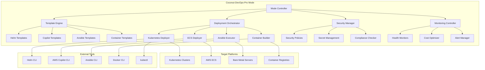

## Core Components

### 1. Mode Controller
**Purpose**: Central orchestration and coordination of all mode operations
**Responsibilities**:
- Command parsing and routing
- Workflow orchestration
- Error handling and recovery
- User interaction management

**Key Features**:
- Unified command interface
- Context-aware operation routing
- Comprehensive error handling
- Progress tracking and reporting

### 2. Template Engine
**Purpose**: Generate and manage infrastructure templates across platforms
**Responsibilities**:
- Template generation and customization
- Variable substitution and validation
- Template versioning and management
- Best practices enforcement

**Template Types**:
- **Helm Charts**: Kubernetes application packaging
- **Copilot Manifests**: AWS ECS service definitions
- **Ansible Playbooks**: Server configuration automation
- **Dockerfiles**: Container image definitions

### 3. Deployment Orchestrator
**Purpose**: Coordinate deployments across multiple platforms
**Responsibilities**:
- Platform-specific deployment logic
- Rollback and recovery mechanisms
- Health check coordination
- Environment promotion workflows

**Deployment Strategies**:
- **Blue-Green Deployments**: Zero-downtime updates
- **Canary Deployments**: Gradual rollout with monitoring
- **Rolling Updates**: Sequential instance replacement
- **Immutable Deployments**: Complete environment replacement

### 4. Security Manager
**Purpose**: Enforce security best practices across all platforms
**Responsibilities**:
- Security policy enforcement
- Secret management and rotation
- Compliance validation
- Vulnerability scanning coordination

**Security Features**:
- **Policy as Code**: Automated security policy enforcement
- **Secret Management**: Centralized secret storage and rotation
- **Compliance Monitoring**: Automated compliance checking
- **Vulnerability Management**: Continuous security scanning

### 5. Monitoring Controller
**Purpose**: Provide comprehensive observability and optimization
**Responsibilities**:
- Health monitoring coordination
- Performance metrics collection
- Cost optimization recommendations
- Alert management and escalation

**Monitoring Capabilities**:
- **Application Health**: Service availability and performance
- **Infrastructure Health**: Resource utilization and capacity
- **Security Monitoring**: Threat detection and response
- **Cost Monitoring**: Resource cost tracking and optimization

## Platform Integration Architecture

### Kubernetes Integration
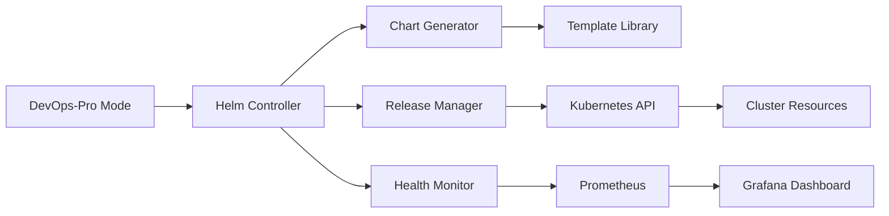

**Integration Points**:
- **Helm 3**: Package management and templating
- **kubectl**: Direct cluster interaction
- **kustomize**: Configuration overlays
- **Prometheus**: Metrics collection
- **Grafana**: Visualization and alerting

### AWS ECS Integration
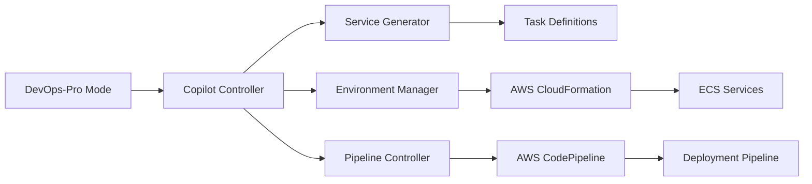

**Integration Points**:
- **AWS Copilot CLI**: Application lifecycle management
- **AWS ECS**: Container orchestration
- **AWS CloudFormation**: Infrastructure provisioning
- **AWS CodePipeline**: CI/CD automation
- **AWS CloudWatch**: Monitoring and logging

### Ansible Integration
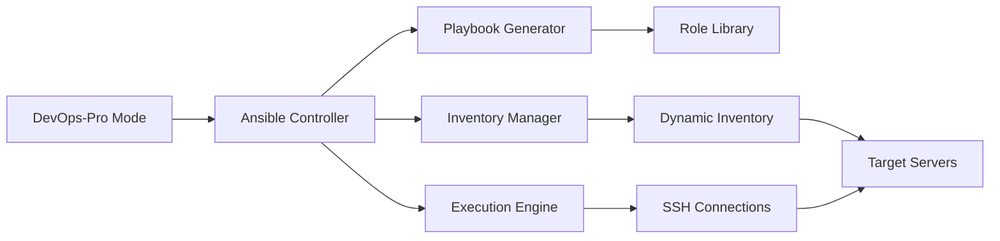

**Integration Points**:
- **Ansible Core**: Automation engine
- **Ansible Galaxy**: Role and collection management
- **Ansible Vault**: Secret management
- **Dynamic Inventory**: Cloud provider integration
- **Ansible Tower/AWX**: Enterprise features (optional)

## Data Flow Architecture

### Deployment Workflow
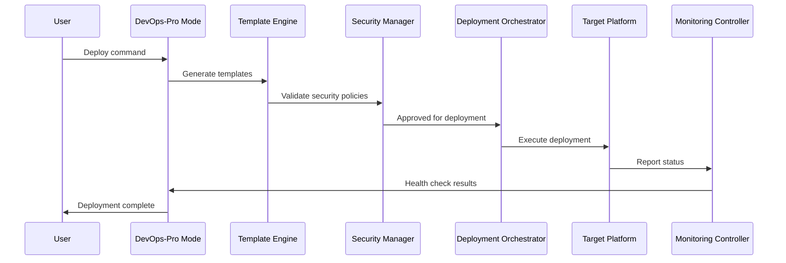

### Monitoring Data Flow
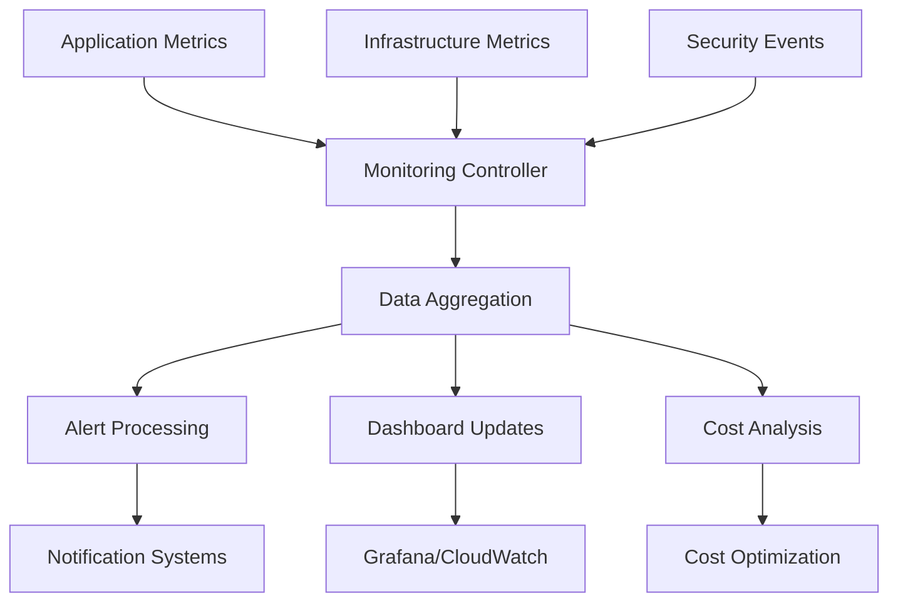

## Security Architecture

### Multi-Layer Security Model
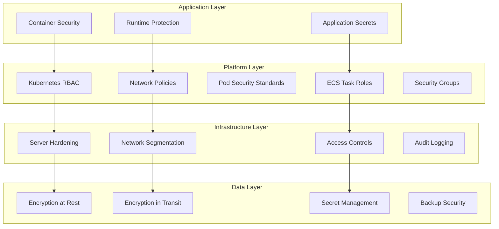

### Secret Management Flow
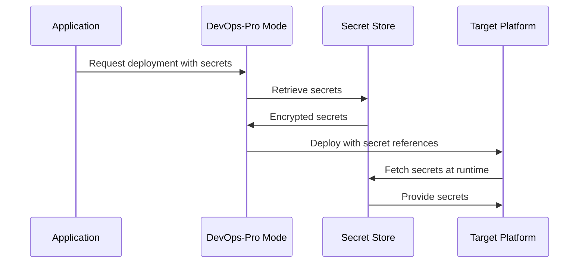

## Scalability Architecture

### Horizontal Scaling Strategy
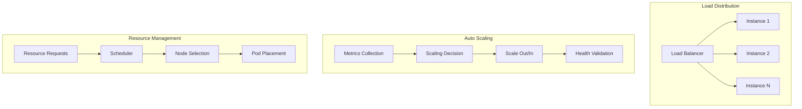

### Performance Optimization
- **Resource Right-sizing**: Automatic resource optimization based on usage patterns
- **Caching Strategies**: Template caching, image layer caching, dependency caching
- **Parallel Processing**: Concurrent deployments and health checks
- **Lazy Loading**: On-demand template and configuration loading

## Disaster Recovery Architecture

### Backup and Recovery Strategy
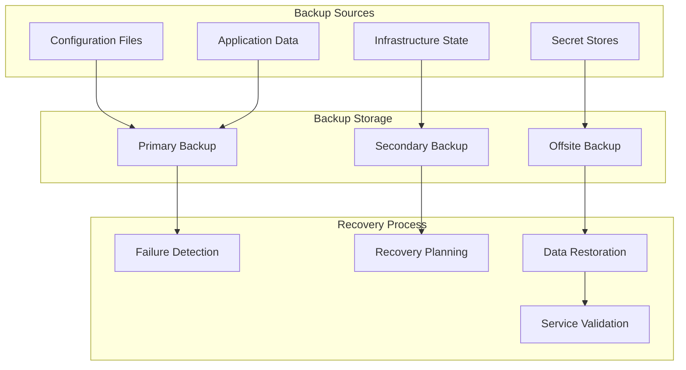

### High Availability Design
- **Multi-Region Deployments**: Geographic distribution for disaster resilience
- **Automated Failover**: Automatic traffic redirection during failures
- **Data Replication**: Real-time data synchronization across regions
- **Health Monitoring**: Continuous health checks with automatic recovery

## Integration Points

### External Tool Integration
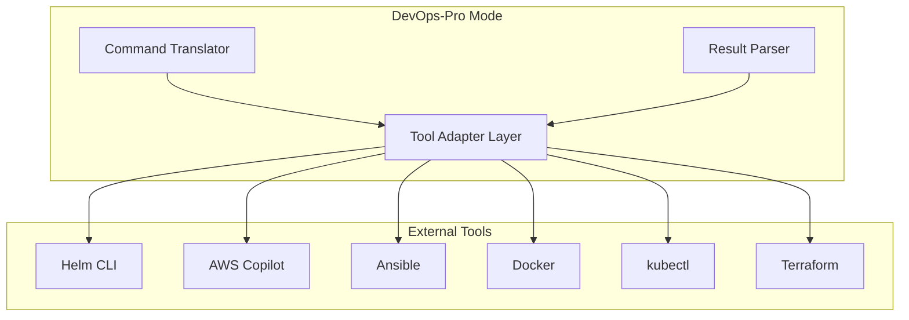

### CI/CD Integration
- **GitHub Actions**: Workflow integration and automation
- **GitLab CI**: Pipeline integration and deployment
- **Jenkins**: Plugin development and integration
- **AWS CodePipeline**: Native AWS integration

## Technology Stack

### Core Technologies
- **Languages**: Python, Bash, YAML, JSON
- **Frameworks**: Click (CLI), Jinja2 (Templating), Pydantic (Validation)
- **Tools**: Helm, AWS Copilot, Ansible, Docker, kubectl
- **Monitoring**: Prometheus, Grafana, CloudWatch, Jaeger

### Platform Dependencies
- **Kubernetes**: v1.24+ with Helm 3.8+
- **AWS**: ECS, ECR, CloudFormation, CodePipeline
- **Ansible**: v4.0+ with required collections
- **Docker**: v20.10+ with BuildKit support

## Quality Attributes

### Performance Requirements
- **Deployment Time**: <5 minutes for standard applications
- **Template Generation**: <30 seconds for complex templates
- **Health Checks**: <10 seconds response time
- **Scalability**: Support 100+ concurrent deployments

### Reliability Requirements
- **Availability**: 99.9% uptime for deployment services
- **Recovery Time**: <15 minutes for service restoration
- **Data Durability**: 99.999% for configuration data
- **Error Rate**: <0.1% deployment failure rate

### Security Requirements
- **Authentication**: Multi-factor authentication support
- **Authorization**: Role-based access control
- **Encryption**: AES-256 for data at rest, TLS 1.3 for transit
- **Compliance**: SOC2, GDPR, HIPAA support

This architecture overview provides the foundation for implementing a robust, scalable, and secure infrastructure management mode that can handle complex deployment scenarios across multiple platforms while maintaining operational excellence.