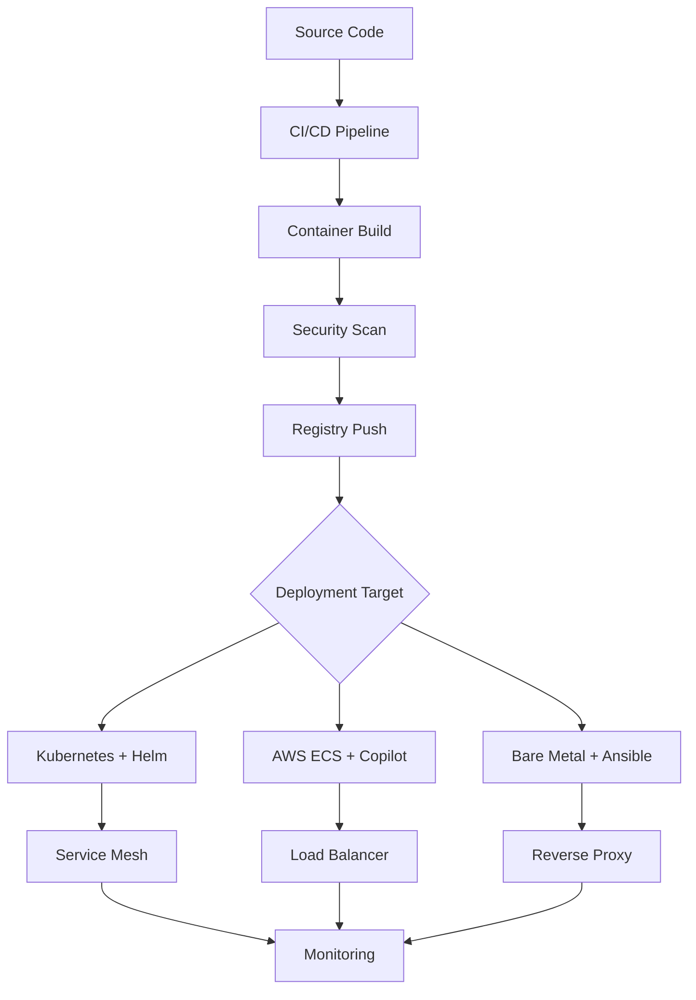
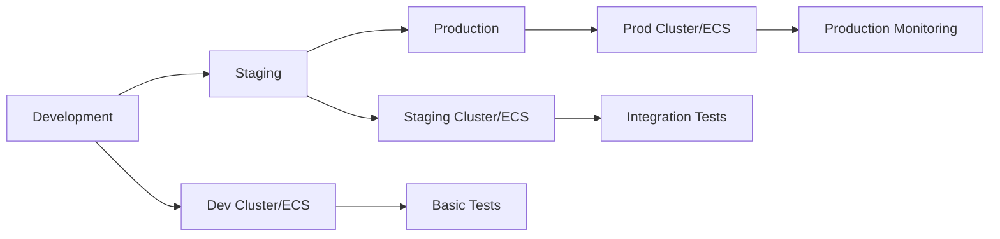
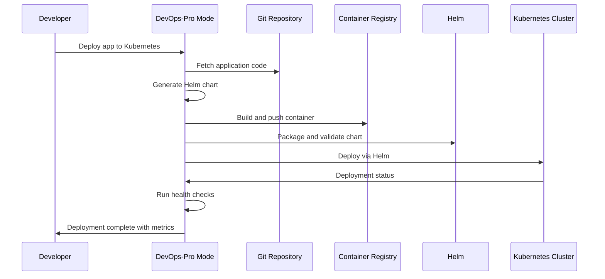
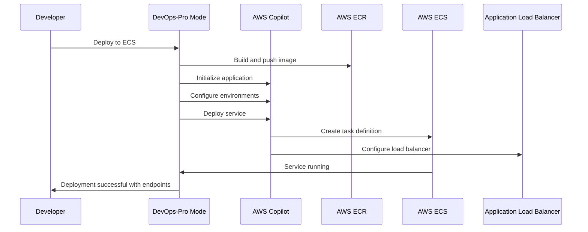
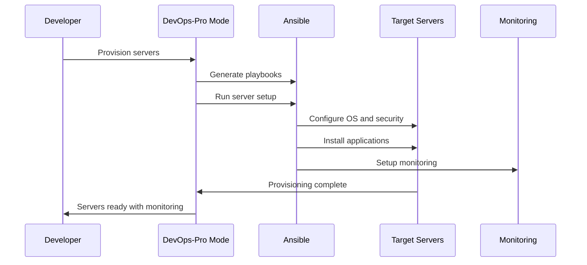

# Coconut-DevOps-Pro Mode - Advanced Infrastructure Management

## Overview

The Coconut-DevOps-Pro mode is an advanced infrastructure management mode that extends beyond the current DevOps capabilities, specializing in modern container orchestration, cloud-native deployments, and automated server provisioning. This mode focuses on providing simple, unified deployment workflows while maintaining enterprise-grade security and scalability.

## Core Capabilities

### 1. Kubernetes Management
- **Helm Chart Creation**: Automated generation of production-ready Helm charts with best practices
- **Cluster Configuration**: Multi-cluster management and configuration
- **Application Deployment**: Streamlined deployment workflows with rollback capabilities
- **Service Mesh Integration**: Istio, Linkerd, and other service mesh implementations
- **Resource Optimization**: CPU/memory optimization and cost management

### 2. AWS + ECS Services
- **AWS Copilot CLI Integration**: Simplified application deployment and management
- **ECS Task Definitions**: Optimized container configurations
- **Load Balancer Configuration**: Application and Network Load Balancer setup
- **Auto Scaling**: Horizontal and vertical scaling configurations
- **Security Groups**: Network security and access control

### 3. Server Provisioning with Ansible
- **Infrastructure Automation**: Server setup and configuration management
- **Security Hardening**: CIS benchmarks and security best practices implementation
- **Application Deployment**: Automated application installation and configuration
- **Monitoring Setup**: Prometheus, Grafana, and alerting system deployment
- **Compliance Management**: Automated compliance checking and reporting

### 4. Container Management
- **Multi-Registry Support**: GitHub Container Registry, AWS ECR, Docker Hub integration
- **Custom Container Creation**: Optimized Docker image building with multi-stage builds
- **Security Scanning**: Vulnerability assessment and remediation
- **Image Optimization**: Size reduction and layer optimization techniques
- **Registry Management**: Automated push/pull workflows across registries

### 5. Unified Deployment Workflows
- **Single Command Deployment**: Deploy to any platform with consistent commands
- **Environment Promotion**: Seamless promotion between dev, staging, and production
- **Rollback Capabilities**: Quick rollback to previous versions with health checks
- **Health Monitoring**: Automated health checks and alerting across all platforms

## Technology Stack Integration

### Kubernetes Ecosystem
- **Helm 3**: Chart templating, dependency management, and release management
- **kubectl**: Direct cluster interaction and resource management
- **kustomize**: Configuration management and environment-specific overlays
- **Ingress Controllers**: NGINX, Traefik, AWS Load Balancer Controller
- **Service Mesh**: Istio, Linkerd for advanced traffic management
- **Monitoring Stack**: Prometheus, Grafana, Jaeger for observability

### AWS Services Integration
- **AWS Copilot**: Application lifecycle management and deployment
- **ECS Fargate/EC2**: Container orchestration and compute management
- **ECR**: Private container registry with vulnerability scanning
- **Application Load Balancer**: Advanced traffic routing and SSL termination
- **CloudWatch**: Comprehensive logging, monitoring, and alerting
- **Systems Manager**: Parameter store, secrets management, and patch management
- **VPC**: Network isolation and security group management

### Container Registry Support
- **GitHub Container Registry (ghcr.io)**: GitHub-native container storage
- **AWS ECR**: Enterprise-grade private registry with security scanning
- **Docker Hub**: Public and private repository management
- **Harbor**: Self-hosted enterprise registry with RBAC and vulnerability scanning

### CI/CD Platform Integration
- **GitHub Actions**: GitHub-native workflows with matrix builds
- **GitLab CI**: GitLab integration with pipeline optimization
- **Jenkins**: Self-hosted automation with plugin ecosystem
- **AWS CodePipeline**: Native AWS CI/CD with CodeBuild integration

### Infrastructure as Code Tools
- **Ansible**: Server provisioning and configuration management
- **Terraform**: Infrastructure provisioning (integration capability)
- **AWS CloudFormation**: Native AWS resource management
- **Pulumi**: Modern infrastructure as code with programming languages

## Architecture Patterns

### Microservices Deployment Pattern

### Multi-Environment Promotion

## Key Features and Capabilities

### 1. Helm Chart Management
- **Automated Chart Generation**: Create production-ready Helm charts with best practices
- **Template Optimization**: Efficient resource templates with proper values and secrets management
- **Dependency Management**: Chart dependencies, sub-charts, and version management
- **Release Management**: Versioning, rollback capabilities, and release notes
- **Security Integration**: Pod security policies, network policies, and RBAC

### 2. AWS Copilot Integration
- **Application Scaffolding**: Quick application setup with environment-specific configurations
- **Environment Management**: Isolated dev, staging, and production environments
- **Service Configuration**: Load balancers, auto-scaling, health checks, and service discovery
- **Pipeline Integration**: Automated deployment pipelines with approval workflows
- **Observability**: Built-in logging, monitoring, and distributed tracing

### 3. Ansible Automation
- **Server Provisioning**: Automated server setup with role-based configurations
- **Security Hardening**: CIS benchmarks, firewall configuration, and access control
- **Application Deployment**: Zero-downtime application deployments with health checks
- **Monitoring Setup**: Automated Prometheus, Grafana, and alerting system deployment
- **Backup and Recovery**: Automated backup strategies and disaster recovery procedures

### 4. Container Lifecycle Management
- **Multi-stage Builds**: Optimized Docker images with minimal attack surface
- **Security Scanning**: Vulnerability assessment with Trivy, Clair, and AWS Inspector
- **Registry Management**: Automated push/pull with authentication and authorization
- **Image Optimization**: Layer caching, compression, and size reduction techniques
- **Compliance**: Image signing, SBOM generation, and policy enforcement

### 5. Unified Deployment Interface
- **Command Standardization**: Consistent deployment commands across all platforms
- **Environment Abstraction**: Platform-agnostic deployment configurations
- **Health Monitoring**: Unified health checks and monitoring across deployments
- **Rollback Automation**: Automated rollback triggers based on health metrics
- **Cost Optimization**: Resource optimization and cost monitoring across platforms

## Workflow Examples

### Kubernetes Application Deployment

### AWS ECS Deployment with Copilot

### Server Provisioning with Ansible

## Mode Specifications

### Role Definition
An advanced DevOps specialist that extends beyond traditional infrastructure management to provide comprehensive Kubernetes, AWS ECS, and server provisioning capabilities. Specializes in creating production-ready Helm charts, managing AWS Copilot deployments, automating server provisioning with Ansible, and implementing unified deployment workflows across multiple container registries and CI/CD platforms. Focuses on security, scalability, and operational excellence.

### When to Use
Use this mode when you need to:
- Create and manage Kubernetes applications with Helm charts
- Deploy containerized applications to AWS ECS using Copilot
- Automate server provisioning and configuration with Ansible
- Build and manage custom containers across multiple registries
- Implement unified deployment workflows across different platforms
- Set up monitoring, logging, and alerting for infrastructure
- Implement security best practices and compliance requirements
- Optimize infrastructure costs and performance

### Tool Groups
- **read**: Full file system access for configuration analysis and template generation
- **edit**: Complete file editing capabilities for infrastructure code and configurations
- **browser**: Web access for documentation, registry management, and cloud console access
- **command**: CLI access for all infrastructure tools (kubectl, helm, aws, ansible, docker)
- **mcp**: MCP server integration for enhanced capabilities and external tool integration

### Custom Instructions
- Always prioritize security best practices in all configurations and deployments
- Implement infrastructure as code principles consistently across all platforms
- Focus on automation, repeatability, and idempotency in all operations
- Ensure multi-environment support (development, staging, production) by default
- Optimize for cost-effectiveness, performance, and resource utilization
- Maintain comprehensive documentation, runbooks, and operational procedures
- Implement monitoring, logging, and alerting as integral parts of all deployments
- Use declarative configurations and avoid imperative commands where possible
- Ensure all deployments are reversible with proper rollback mechanisms
- Implement proper secret management and avoid hardcoded credentials

## Implementation Strategy

### Phase 1: Core Infrastructure (Weeks 1-2)
- Create mode configuration and basic capabilities
- Implement Helm chart generation templates with best practices
- Set up AWS Copilot integration patterns and templates
- Create foundational Ansible playbook templates for common scenarios
- Establish basic container build and registry integration

### Phase 2: Advanced Features (Weeks 3-4)
- Implement multi-registry support with authentication management
- Create advanced Helm chart templates with security policies
- Set up comprehensive AWS Copilot environment management
- Develop advanced Ansible roles for security hardening and monitoring
- Implement automated security scanning and vulnerability management

### Phase 3: Integration and Automation (Weeks 5-6)
- Create unified deployment command interface
- Implement cross-platform health monitoring and alerting
- Set up automated rollback mechanisms and disaster recovery
- Integrate with existing CI/CD platforms and workflows
- Develop cost optimization and resource management features

### Phase 4: Optimization and Enhancement (Weeks 7-8)
- Performance optimization for large-scale deployments
- Advanced customization options and configuration management
- Integration with existing Coconut modes and Memory Bank system
- Comprehensive testing, validation, and documentation
- User experience improvements and workflow optimization

## Success Criteria

### Deployment Efficiency
- Reduce deployment time by 70% compared to manual processes
- Achieve 99.9% deployment success rate across all platforms
- Enable zero-downtime deployments with automated health checks
- Provide consistent deployment experience across Kubernetes, ECS, and bare metal

### Infrastructure Quality
- Implement security best practices by default in all configurations
- Achieve cost optimization targets with automated resource management
- Maintain high availability (99.95%+) and performance standards
- Ensure compliance with industry standards and regulations

### Developer Experience
- Provide simple, unified commands for complex infrastructure operations
- Enable self-service infrastructure provisioning with proper guardrails
- Reduce learning curve for new team members with comprehensive documentation
- Offer clear error messages and troubleshooting guidance

### Operational Excellence
- Implement comprehensive monitoring and alerting across all platforms
- Provide automated backup and disaster recovery capabilities
- Enable rapid incident response with proper runbooks and procedures
- Maintain infrastructure documentation and change management

## Risk Mitigation

### Technical Risks
- **Complexity Management**: Start with simple templates and gradually enhance functionality
- **Platform Integration**: Thorough testing with all supported platforms and services
- **Performance Issues**: Implement caching, optimization, and incremental deployment strategies
- **Security Vulnerabilities**: Regular security audits and automated vulnerability scanning

### Operational Risks
- **Learning Curve**: Comprehensive documentation, examples, and training materials
- **Change Management**: Proper versioning, rollback mechanisms, and change approval workflows
- **Dependency Management**: Clear dependency mapping and version compatibility matrices
- **Incident Response**: Automated monitoring, alerting, and incident response procedures

### Business Risks
- **Cost Overruns**: Automated cost monitoring, budgeting, and optimization recommendations
- **Vendor Lock-in**: Multi-cloud and platform-agnostic design principles
- **Compliance Issues**: Automated compliance checking and audit trail maintenance
- **Skills Gap**: Knowledge transfer, documentation, and training programs

## Future Enhancements

### Advanced Capabilities
- **Multi-Cloud Support**: Azure, Google Cloud Platform integration
- **GitOps Integration**: ArgoCD, Flux for declarative deployments
- **Service Mesh Advanced Features**: Traffic splitting, canary deployments
- **AI-Powered Optimization**: Machine learning for resource optimization and cost prediction

### Ecosystem Integration
- **Terraform Integration**: Infrastructure provisioning with Terraform modules
- **Vault Integration**: Advanced secret management with HashiCorp Vault
- **Observability Enhancement**: OpenTelemetry, Jaeger, and advanced APM integration
- **Compliance Automation**: Automated compliance reporting and remediation

### Developer Experience
- **IDE Integration**: VS Code extensions and development environment setup
- **Local Development**: Docker Compose and local Kubernetes development workflows
- **Testing Frameworks**: Automated testing for infrastructure code and deployments
- **Documentation Generation**: Automated documentation from infrastructure code

## Conclusion

The Coconut-DevOps-Pro mode represents a significant advancement in infrastructure management capabilities, providing comprehensive support for modern container orchestration, cloud-native deployments, and automated server provisioning. By focusing on simplicity, security, and operational excellence, this mode will enable teams to deploy and manage applications across multiple platforms with confidence and efficiency.

The unified deployment approach, combined with best-practice templates and automated workflows, will dramatically reduce the complexity of modern infrastructure management while maintaining enterprise-grade security and scalability requirements.