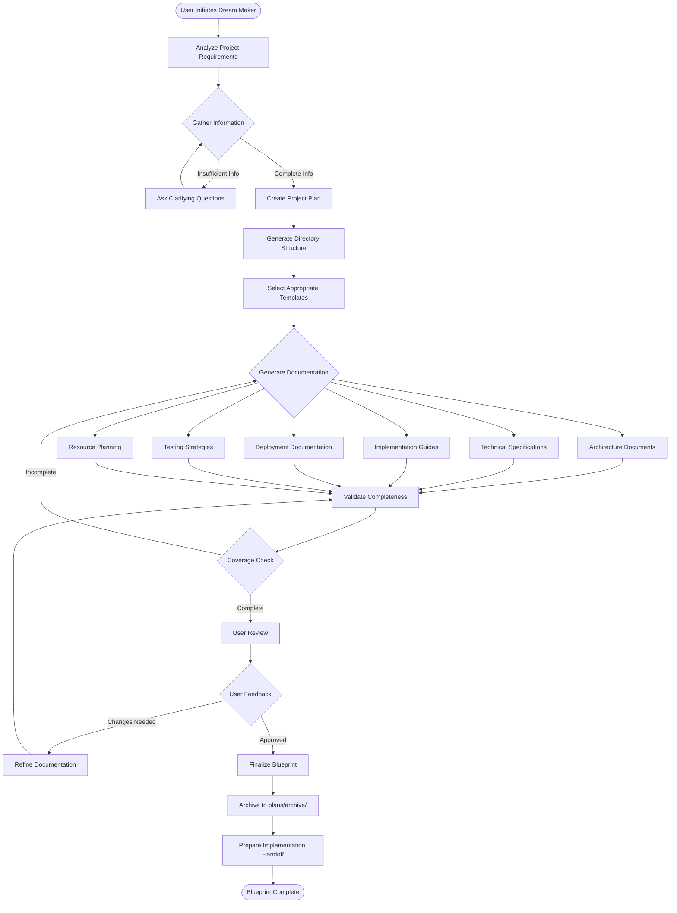
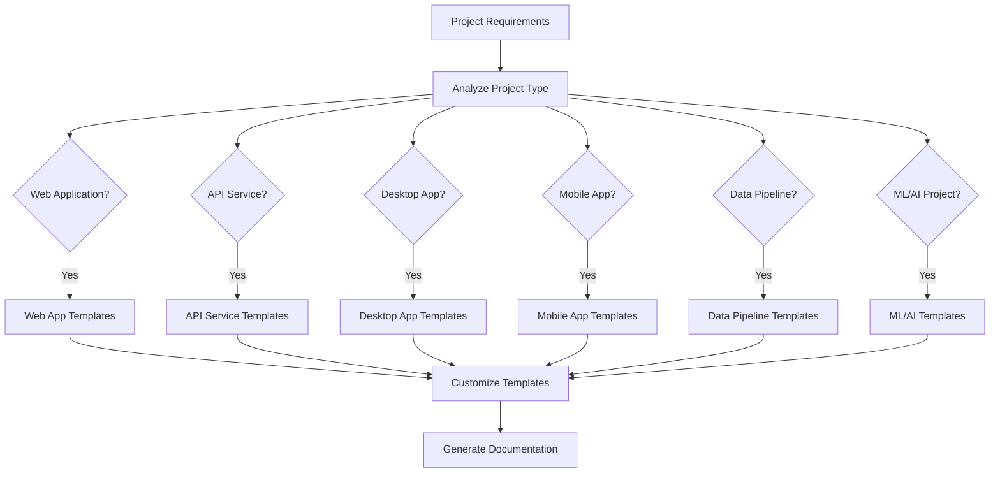
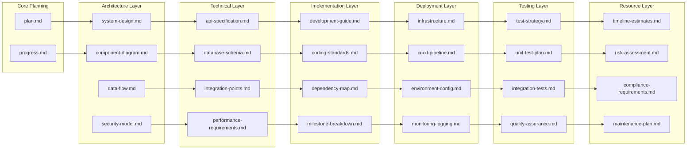
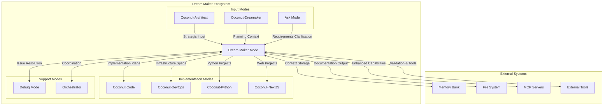

# Dream Maker Mode - Architecture Overview

## System Architecture

```mermaid
graph TB
    subgraph "Dream Maker Mode Core"
        DM[Dream Maker Mode]
        PG[Plan Generator]
        TM[Template Manager]
        DG[Documentation Generator]
        VE[Validation Engine]
    end
    
    subgraph "Input Sources"
        UR[User Requirements]
        PC[Project Context]
        MB[Memory Bank]
        EF[Existing Files]
    end
    
    subgraph "Template System"
        AT[Architecture Templates]
        TS[Technical Spec Templates]
        IT[Implementation Templates]
        DT[Deployment Templates]
        TT[Testing Templates]
    end
    
    subgraph "Output Structure"
        BP[Blueprint Directory]
        AD[Architecture Docs]
        TD[Technical Docs]
        ID[Implementation Docs]
        DD[Deployment Docs]
        TSD[Testing Docs]
        RD[Resource Docs]
    end
    
    subgraph "Integration Points"
        CM[Coconut Modes]
        MBS[Memory Bank System]
        FS[File System]
        ET[External Tools]
    end
    
    UR --> DM
    PC --> DM
    MB --> DM
    EF --> DM
    
    DM --> PG
    DM --> TM
    DM --> DG
    DM --> VE
    
    TM --> AT
    TM --> TS
    TM --> IT
    TM --> DT
    TM --> TT
    
    PG --> BP
    DG --> AD
    DG --> TD
    DG --> ID
    DG --> DD
    DG --> TSD
    DG --> RD
    
    VE --> BP
    
    DM <--> CM
    DM <--> MBS
    DM --> FS
    DM <--> ET
```

## Workflow Process

## Template Selection Logic

## Documentation Hierarchy Flow

## Integration with Existing Modes

## Key Features and Capabilities

### Automated Documentation Generation
- **Context-Aware Templates**: Intelligent selection based on project type and requirements
- **Cross-Reference Management**: Automatic linking and consistency checking across documents
- **Progressive Enhancement**: Iterative refinement based on user feedback and validation
- **Export Capabilities**: Multiple format support for different stakeholders

### Comprehensive Coverage Validation
- **Completeness Checking**: Ensures all critical project aspects are documented
- **Dependency Mapping**: Validates all dependencies and requirements are captured
- **Quality Assurance**: Automated checks for documentation quality and consistency
- **Gap Analysis**: Identifies missing information and suggests improvements

### Integration and Workflow
- **Memory Bank Synchronization**: Seamless integration with existing project context
- **Mode Handoff**: Smooth transition to implementation modes with complete documentation
- **Progress Tracking**: Real-time monitoring of blueprint creation and validation
- **Collaborative Features**: Support for team review and feedback incorporation

This architecture ensures that the Dream Maker mode provides comprehensive, automated project blueprint generation while maintaining seamless integration with the existing mode ecosystem.