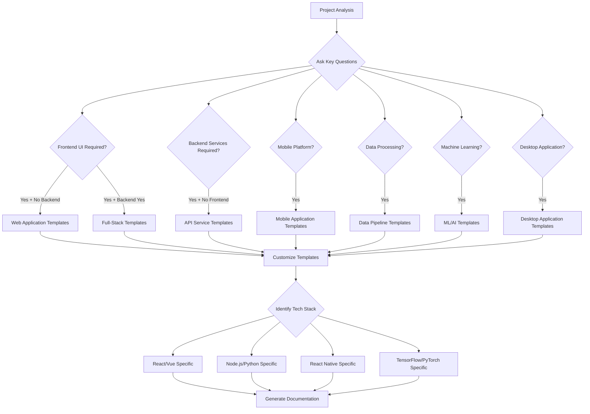

# Dream Maker Mode - Project Type Specialized Templates

## Overview

The Dream Maker mode includes specialized documentation templates tailored for different project types. Each template set is optimized for the specific requirements, technologies, and best practices of its respective domain.

## Project Type Classification

### 1. Web Applications
**Characteristics**: Frontend-focused, user interface driven, responsive design
**Technologies**: React, Vue, Angular, HTML/CSS/JS, Next.js, Nuxt.js
**Key Focus**: User experience, responsive design, performance, accessibility

### 2. API Services
**Characteristics**: Backend services, RESTful/GraphQL APIs, microservices
**Technologies**: Node.js, Python (FastAPI/Django), Java (Spring), .NET
**Key Focus**: API design, scalability, security, documentation

### 3. Full-Stack Applications
**Characteristics**: Complete web applications with frontend and backend
**Technologies**: MEAN/MERN stack, Django + React, Rails + Vue
**Key Focus**: End-to-end architecture, data flow, integration

### 4. Mobile Applications
**Characteristics**: Native or cross-platform mobile apps
**Technologies**: React Native, Flutter, Swift, Kotlin, Xamarin
**Key Focus**: Platform-specific considerations, app store deployment

### 5. Desktop Applications
**Characteristics**: Native desktop software
**Technologies**: Electron, .NET, Java Swing, Qt, Tauri
**Key Focus**: Platform integration, distribution, user experience

### 6. Data Pipeline/ETL
**Characteristics**: Data processing, transformation, analytics
**Technologies**: Apache Airflow, Spark, Kafka, Python, SQL
**Key Focus**: Data flow, processing efficiency, monitoring

### 7. Machine Learning/AI
**Characteristics**: ML models, training pipelines, inference services
**Technologies**: Python (TensorFlow/PyTorch), MLflow, Kubeflow
**Key Focus**: Model lifecycle, data management, deployment

### 8. DevOps/Infrastructure
**Characteristics**: Infrastructure automation, CI/CD, monitoring
**Technologies**: Terraform, Kubernetes, Docker, AWS/Azure/GCP
**Key Focus**: Automation, scalability, reliability

## Template Specifications by Project Type

### Web Application Templates

#### Architecture Documentation
```
architecture/
├── system-design.md           # Frontend architecture, component hierarchy
├── component-diagram.md       # UI component relationships and data flow
├── data-flow.md              # State management and data binding
├── security-model.md         # Authentication, authorization, XSS protection
└── performance-model.md      # Loading strategies, caching, optimization
```

#### Technical Specifications
```
technical-specs/
├── ui-ux-specification.md    # Design system, responsive breakpoints
├── api-integration.md        # Backend API consumption patterns
├── state-management.md       # Redux/Vuex/Context API patterns
├── routing-navigation.md     # Client-side routing and navigation
└── browser-compatibility.md # Cross-browser support requirements
```

#### Implementation Guides
```
implementation/
├── development-setup.md      # Local development environment
├── component-guidelines.md   # Component creation and styling
├── testing-approach.md       # Unit, integration, e2e testing
├── build-deployment.md       # Build process and deployment
└── accessibility-guide.md    # WCAG compliance and best practices
```

### API Service Templates

#### Architecture Documentation
```
architecture/
├── system-design.md          # Service architecture, microservices design
├── api-design.md            # RESTful/GraphQL design principles
├── data-model.md            # Database schema and relationships
├── security-model.md        # Authentication, rate limiting, validation
└── scalability-model.md     # Load balancing, caching, performance
```

#### Technical Specifications
```
technical-specs/
├── api-specification.md     # OpenAPI/Swagger documentation
├── database-schema.md       # Entity relationships, indexes, constraints
├── authentication-spec.md   # JWT, OAuth, API key management
├── error-handling.md        # Error codes, response formats
└── rate-limiting.md         # Throttling and quota management
```

#### Implementation Guides
```
implementation/
├── development-setup.md     # Local API development environment
├── endpoint-implementation.md # Controller/handler patterns
├── middleware-guide.md      # Authentication, logging, validation
├── testing-strategy.md      # Unit, integration, contract testing
└── monitoring-logging.md    # APM, structured logging, metrics
```

### Full-Stack Application Templates

#### Architecture Documentation
```
architecture/
├── system-design.md         # End-to-end architecture overview
├── frontend-backend-integration.md # API contracts and communication
├── data-flow.md            # Complete data flow from UI to database
├── security-model.md       # Full-stack security considerations
└── deployment-architecture.md # Infrastructure and hosting strategy
```

#### Technical Specifications
```
technical-specs/
├── api-specification.md    # Backend API documentation
├── frontend-specification.md # UI/UX and component specifications
├── database-design.md      # Complete database schema
├── integration-points.md   # Third-party services and APIs
└── real-time-features.md   # WebSocket, SSE, real-time updates
```

### Mobile Application Templates

#### Architecture Documentation
```
architecture/
├── app-architecture.md     # Native/cross-platform architecture
├── navigation-flow.md      # Screen navigation and user flows
├── data-management.md      # Local storage, offline capabilities
├── platform-integration.md # OS-specific features and APIs
└── performance-model.md    # Memory management, battery optimization
```

#### Technical Specifications
```
technical-specs/
├── platform-requirements.md # iOS/Android version support
├── ui-design-system.md     # Platform-specific design guidelines
├── api-integration.md      # Backend service integration
├── push-notifications.md  # Notification strategy and implementation
└── app-store-requirements.md # Store submission guidelines
```

### Data Pipeline Templates

#### Architecture Documentation
```
architecture/
├── pipeline-architecture.md # Data flow and processing stages
├── data-sources.md         # Input sources and ingestion methods
├── transformation-logic.md  # Data processing and transformation
├── storage-strategy.md     # Data warehouse, lake, and caching
└── monitoring-alerting.md  # Pipeline health and error handling
```

#### Technical Specifications
```
technical-specs/
├── data-schema.md          # Input/output data formats and schemas
├── processing-requirements.md # Performance and throughput specs
├── quality-validation.md   # Data quality checks and validation
├── scheduling-orchestration.md # Job scheduling and dependencies
└── disaster-recovery.md    # Backup and recovery procedures
```

### Machine Learning Templates

#### Architecture Documentation
```
architecture/
├── ml-pipeline-architecture.md # Training and inference pipelines
├── data-management.md      # Dataset management and versioning
├── model-architecture.md   # Model design and selection
├── deployment-strategy.md  # Model serving and scaling
└── monitoring-mlops.md     # Model performance and drift detection
```

#### Technical Specifications
```
technical-specs/
├── model-requirements.md   # Performance metrics and constraints
├── data-preprocessing.md   # Feature engineering and preparation
├── training-specification.md # Training parameters and procedures
├── inference-api.md        # Model serving API specification
└── experiment-tracking.md  # MLflow, Weights & Biases integration
```

## Template Selection Algorithm



## Technology-Specific Customizations

### Frontend Frameworks

#### React/Next.js Customizations
- Component lifecycle and hooks documentation
- State management with Redux/Zustand
- Server-side rendering considerations
- Performance optimization with React DevTools

#### Vue/Nuxt.js Customizations
- Vue composition API patterns
- Vuex state management
- Vue Router configuration
- Nuxt.js module system

#### Angular Customizations
- Component and service architecture
- RxJS reactive programming patterns
- Angular CLI and workspace configuration
- NgRx state management

### Backend Frameworks

#### Node.js/Express Customizations
- Middleware architecture
- Async/await patterns
- NPM package management
- PM2 process management

#### Python/Django Customizations
- Django app structure
- ORM and database migrations
- Django REST framework
- Celery task queues

#### Python/FastAPI Customizations
- Pydantic models and validation
- Async request handling
- OpenAPI automatic documentation
- Dependency injection patterns

### Database Technologies

#### SQL Databases (PostgreSQL, MySQL)
- Relational schema design
- Index optimization
- Migration strategies
- Connection pooling

#### NoSQL Databases (MongoDB, DynamoDB)
- Document schema design
- Query optimization
- Sharding and replication
- Consistency models

#### Cache Systems (Redis, Memcached)
- Caching strategies
- Session management
- Pub/sub patterns
- Performance optimization

## Template Content Generation Rules

### Automated Content Population
1. **Project Name Substitution**: Replace placeholders with actual project name
2. **Technology Stack Integration**: Include specific technology documentation
3. **Best Practices Inclusion**: Add framework-specific best practices
4. **Example Code Snippets**: Generate relevant code examples
5. **Configuration Templates**: Create technology-specific config files

### Cross-Reference Generation
1. **Automatic Linking**: Link related sections across documents
2. **Dependency Mapping**: Map technical dependencies between components
3. **API Contract Consistency**: Ensure API specs match implementation guides
4. **Testing Alignment**: Align test strategies with architecture decisions

### Validation Rules
1. **Completeness Checking**: Ensure all required sections are populated
2. **Consistency Validation**: Check for conflicting information
3. **Technology Compatibility**: Validate technology stack compatibility
4. **Best Practice Compliance**: Check against established patterns

This specialized template system ensures that each project type receives documentation that is specifically tailored to its unique requirements, technologies, and best practices, while maintaining consistency and completeness across all generated blueprints.